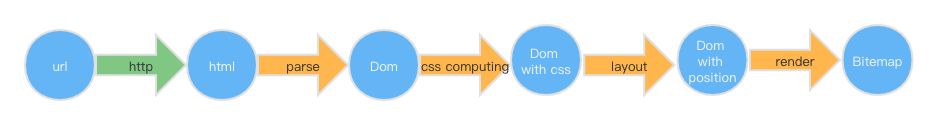

1. 三周的学习里程碑

  

2. 学习过程
  首先从生涩难懂的状态机入手，一步步加料，到最后能用状态机完成一个简单的demo，此时已有些许满足感以及掌控知识原理的自信，只不过涉及到KMP算法仍觉无比奇妙，仍需要反复研究，理解代码背后的严谨逻辑和奇妙解决。
  第一个路标比较简单，获取URL的内容并返回为HTML代码，需理解HTTP协议以及相关；
  第二步用状态机去匹配对应的dom元素，学的时候觉得麻烦，回头想原理还是算简单；
  第三步要去收集css,并匹配到元素，学完感受同第二步；
  第四步给元素布局，用的flex布局做示例，之前对flex的理解仅限于自己用到的一些语法，通过去实现位置计算理解了各个属性的不同作用，非常深刻；
  最后一章是绘制。其实整个demo的实现非常清晰，也在这个学习过程中意识到了“布局”的重要性，心中知道要做什么，再来一步步实现，一步步完善。我觉得在整个学习的过程中，一个是学到了一些浏览器的知识，冰山一角；一部分是通过实现浏览器，反过来思考平时写代码的一些规则，怎么写浏览器更容易计算解析的代码；另一部分是对一个项目的完成节奏的把控
